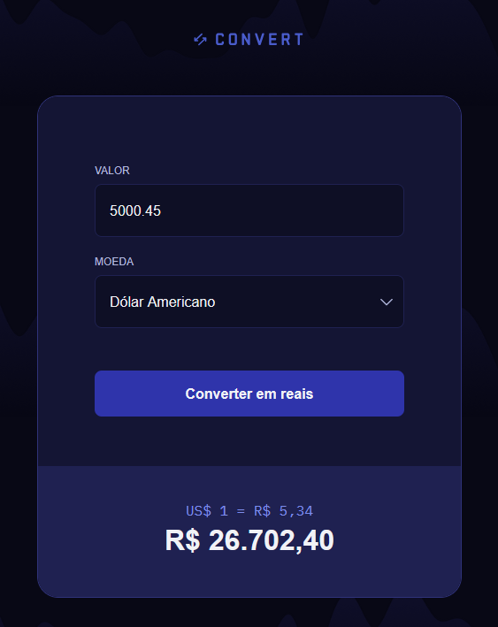

# Convert

Aplicação web desenvolvida durante a formação fullstack da Rocketseat para converter valores de moedas estrangeiras (Dólar Americano, Euro e Libra Esterlina) para o Real Brasileiro, com experiência de uso simples e direta.

O projeto foi construído como peça de portfólio para demonstrar manipulação de DOM, validação de inputs com regex e formatação de dados financeiros, utilizando JavaScript.

## Felipe Mendes
Desenvolvedor Full Stack Júnior

**Contato**

## Preview

## Sobre o projeto

O Convert é uma calculadora de câmbio que recebe um valor numérico e uma moeda de origem e exibe o resultado convertido para Reais, mostrando também a cotação unitária utilizada na conversão.

O projeto explora boas práticas de manipulação de formulários, tratamento de entradas inválidas e formatação de valores monetários no padrão brasileiro.

## Funcionalidades

- Seleção de moeda entre Dólar Americano (USD), Euro (EUR) e Libra Esterlina (GBP)
- Validação de input em tempo real com regex (aceita apenas valores numéricos com até duas casas decimais)
- Exibição da cotação unitária da moeda selecionada
- Cálculo e exibição do valor convertido em Reais
- Formatação do resultado no padrão brasileiro via `Intl` (ex: R$ 26.702,40)
- Tratamento de erros com alertas amigáveis ao usuário

## Tecnologias utilizadas

- JavaScript
- (HTML e CSS foram fornecidos como materiais de apoio pela Rocketseat)

## Fluxo da aplicação

1. O usuário digita o valor que deseja converter.
2. Seleciona a moeda de origem (USD, EUR ou GBP).
3. Clica em **Converter em reais**.
4. A aplicação exibe a cotação unitária e o valor total convertido em Reais.

## Como executar

https://felipemasdev.github.io/convert/

## Aprendizados do projeto

Este projeto consolida prática em:

- Manipulação de DOM e eventos de formulário com JavaScript puro
- Validação e sanitização de inputs com expressões regulares (Regex)
- Formatação de valores financeiros com a API `Intl.NumberFormat`
- Tratamento de erros e feedback visual ao usuário
